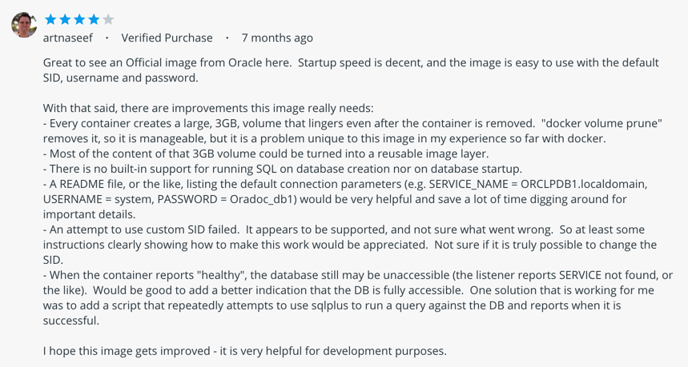

# WGU C993 - ORACLE SQL Study Tool

## Quick Start

```bash
$ ./run-oracle-image.sh
$ ./sqlplus.sh
```

This will install 

## What is it?

This is a simple tool that allows you to run the Oracle database on your machine with _decently_ minimal manual intervention. It can't be 100% automated due to how Oracle licenses their binary files, but otherwise it's almost completely hands off.

## Why?

While studing for the [Oracle Database SQL 1Z0-071 Certification](https://education.oracle.com/oracle-database-sql/pexam_1Z0-071) through my [Computer Science program at WGU](https://www.wgu.edu/content/dam/western-governors/documents/programguides/2017-guides/it/BSCS.pdf) I found that needed to work with a real instance of oracle. There's [an online version]((http://livesql.oracle.com/)) provided by oracle, but it's fairly bare bones in terms of supported functionality. You only get read access to the sample schemas (so no practice with [DDL](https://en.wikipedia.org/wiki/Data_definition_language)s) and you can't work with variables, which is a very fundamental block of SQL.

## How?

Oracle does provide [an image in dockerhub](https://hub.docker.com/_/oracle-database-enterprise-edition), but it's fairly hard to customize or get working with. There is suprisingly little documentation as well, to find the default login you have to go through the reviews of the image to find what one user posted



Which makes it difficult to even get it functional for practice. So what can we do? Oracle has at least provided [a script that is capable of building our own docker image](https://github.com/oracle/docker-images/tree/master/OracleDatabase/SingleInstance).
 * What this tool does is pull down [that script](https://github.com/oracle/docker-images/blob/master/OracleDatabase/SingleInstance/dockerfiles/buildDockerImage.sh)
 * Copy over [the binary file](https://www.oracle.com/database/technologies/oracle12c-linux-12201-downloads.html) after you've downloaded it via your browser (which has to be done this way because of licensing for legality purposes)
 * build the base oracle image
 * extend the image to install all [the sample schemas that are available from oracle](https://docs.oracle.com/database/121/COMSC/toc.htm).
